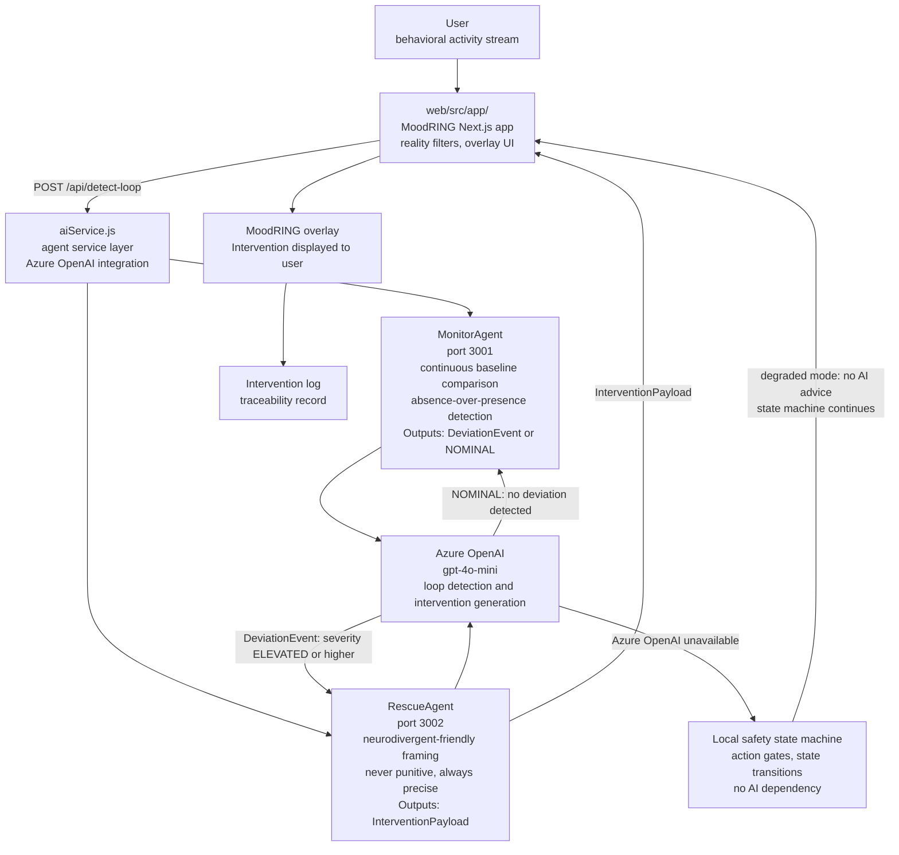
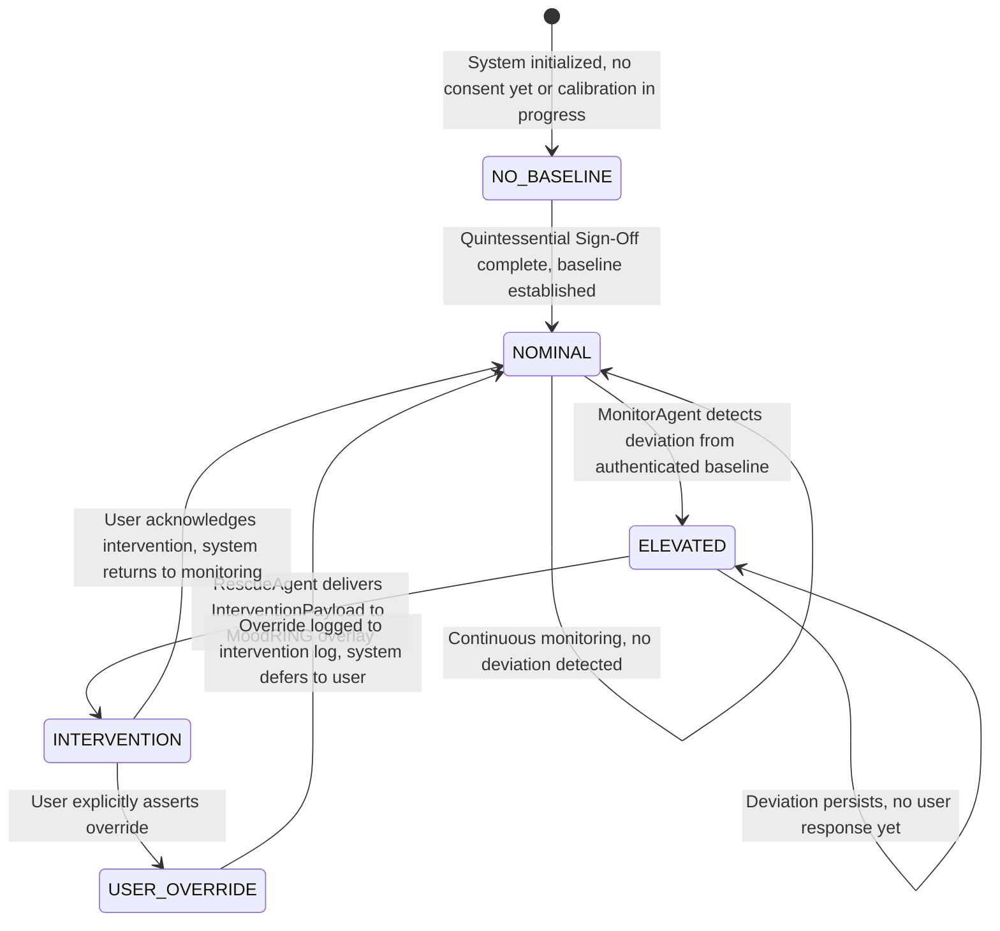
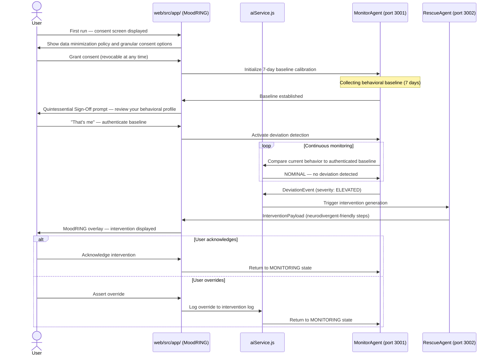

> RESEARCH PROTOTYPE. Not a medical device, clinical monitoring system, crisis-response tool, or substitute for professional care. Behavioral signals detected by this system are heuristic indicators only. Nothing in this system constitutes a clinical assessment, diagnosis, or recommendation for intervention. If you or someone you know is in crisis, contact the 988 Suicide and Crisis Lifeline (call or text 988) or emergency services.

## Safety, Consent, and Limits

### Consent Model

UICare will not activate behavioral monitoring without explicit, granular user consent. The planned Quintessential Sign-Off protocol requires the user to review and authenticate their own behavioral baseline before the system begins deviation detection. Consent is revocable at any time. On revocation, behavioral data is cleared locally. No behavioral data is transmitted to external systems without separate explicit consent.

### Data Minimization

All behavioral signal processing is designed to run locally. The current implementation uses Azure OpenAI for loop detection; this dependency is flagged as a privacy risk and is on the roadmap to be replaced with local-first signal evaluation for the core safety state machine.

### User Override and Appeal

A user who disagrees with the system state assessment can manually override their current state at any time. The system is designed to respect self-determination. Denial is recognized as a common response pattern for neurodivergent users in high-intensity states; the system logs the override but does not block the user from proceeding.

### Failure Modes

- False positive: system flags elevated state during a productive focused-work period. Mitigation: user override always available.
- False negative: system does not detect a genuine distress state. Mitigation: self-declaration crisis trigger always available, independent of automated detection.
- Missing baseline: system has insufficient data to establish a 7-day behavioral baseline. Mitigation: system defaults to NOMINAL state (no gates activated) until baseline is established.
- Agent unavailability: Azure OpenAI endpoint unavailable. Mitigation: local safety logic (state machine, action gates) continues operating; AI advice is degraded gracefully.

### Ethical Risks

Behavioral surveillance of neurodivergent users carries inherent risks: stigma, overreach, false authority, and erosion of agency. This system is designed to give agency back, not to remove it. Key design constraints: (1) the system never acts without consent, (2) all interventions are suggestions, not blocks, except in explicitly user-authorized gate states, (3) no data is shared with third parties, (4) the system is transparent about its own uncertainty.

### What This System Does Not Detect or Guarantee

- Clinical mental health conditions
- Suicidal ideation or self-harm risk beyond the documented crisis threshold
- Medication effects or physiological states
- Interventions are not therapeutic and are not delivered by licensed clinicians
- Baseline accuracy is heuristic, not clinically validated

---

# UICare-System

## What This Is

An agentic AI confidante that detects when users are in distress — not by watching what they do, but by knowing them well enough to notice what they stop doing. UICare-System deploys coordinated AI agents (MonitorAgent + RescueAgent) that build deep behavioral profiles and detect deviation from a user's authenticated baseline. When something is off, the system intervenes — not with alerts, but with the intuitive precision of someone who reads the room.

## What Safety Problem It Addresses

**Domain:** Human Safety
**Failure class:** A system is designed around the median user and the result is that anyone outside that median is left behind or harmed.

Current behavior-monitoring systems capture what users *do* — clicks, keystrokes, time-on-task. They miss what matters most: what users *stop* doing. The spot in the room they're avoiding with their body but can't keep their eyes off. The file they haven't touched in three days when they normally open it first. The commit pattern that went from structured to chaotic overnight. For neurodivergent users — people with ADHD, autism, OCD, schizophrenia, anxiety — the absence of expected behavior is the signal, not the presence of abnormal behavior.

No user behavior system has a system that reads the room for the right signs. UICare does.

## Why It Matters

> Systems must govern truth, behavior, and human outcomes. Alignment includes human interpretation.

People are not disabled. People are *dis-enabled* by systems that cannot see them. A neurodivergent developer stuck in an edit-revert loop for 45 minutes is not "having difficulty" — the system is failing to detect and intervene. A person in a manic state exhibits an exquisite and specific mix of micro-behaviors that someone who knows them intimately would spot in seconds. UICare-System is the AI that knows you that well — and acts on it even when you deny something is wrong, because denial is itself a common and predictable response for people on the spectrum or in high-intensity states.

This is not a productivity tool. This is a safety system. The confidante — in the way Shakespeare portrays a confidante. Not an authority. Not a therapist. The person who sees you clearly because they've been in the room with you long enough to know the difference between you and not-you.

## How It Fits the Platform / Domain

**Domain:** Human Safety
**Platform role:** Consumer-facing human-preservation product under Safety Systems Design
**Invariants enforced:** I1 (Evidence-First — behavioral baselines require evidence), I4 (Traceability Mandatory — every intervention is logged), I5 (Safety Over Fluency — intervene even when the user says they're fine)

### Core Innovation: Reading the Room

People who are good at reading the room have three things:

1. **Classic human tropes** — how, based on centuries of storytelling, most people are likely to behave in a given situation
2. **Awareness of human difference** — that a person may respond differently within the same trope due to neurodivergence, trauma, or lived experience
3. **Heightened anomaly detection** — "something's off" based on deep personal experience of being in lots of rooms with lots of people

UICare operationalizes all three through the **Quintessential Sign-Off** protocol: an exhaustive profile of "normal," "good," and "okay" behaviors — a collection of micro-actions, expressions, movement patterns, and engagement with environment — that the user themselves signs off on. "That's me." Without this sign-off, the system does not activate. Consent is the precondition, not an afterthought.

Any deviation from this authenticated baseline means something is wrong. The key insight: **absence over presence**. It's not what the user is doing that triggers detection — it's what they're not doing.

### Agent Architecture

The system connects four layers: the web frontend, the agent service, two specialized AI agents, and the Azure OpenAI API. User behavioral signals flow from the MoodRING Next.js app through aiService.js to MonitorAgent and RescueAgent. When MonitorAgent detects a deviation from the user's authenticated baseline, it triggers RescueAgent, which returns a structured intervention payload that the web app renders as a MoodRING overlay.



**Reading this diagram without sight:** The user's behavioral activity stream enters the MoodRING Next.js app at web/src/app. The app sends POST requests to the /api/detect-loop endpoint handled by aiService.js, the agent service layer with Azure OpenAI integration. aiService.js routes requests to MonitorAgent on port 3001 and RescueAgent on port 3002. Both agents call Azure OpenAI using gpt-4o-mini. If Azure OpenAI is unavailable, the system falls back to a local safety state machine with action gates — the state machine continues operating in degraded mode with no AI advice. When MonitorAgent detects deviation at severity ELEVATED or higher, it triggers RescueAgent, which returns an InterventionPayload using neurodivergent-friendly framing. The InterventionPayload flows back to the web app, which renders it as a MoodRING overlay to the user. Every intervention is written to an intervention log for traceability.

### Roadmap: Reading the Room Data

The current system detects behavioral loops in text and interaction patterns. The long-term vision extends to environmental sensing — cameras and sensors that capture not just what a person does, but how they relate to objects and spaces in their environment:

- What spot are they avoiding with their body but watching with their eyes?
- What aren't they touching, and why?
- What micro-movements have disappeared from their routine?

This is the missing piece in behavioral detection. Current sensors capture actions. UICare will capture the *absence* of expected actions — the most reliable predictor of mood state and behavioral crisis.

### Behavioral State Machine

The system tracks the user through five named states. Every transition is triggered by a specific condition. The USER_OVERRIDE state is always reachable from INTERVENTION — this is not a safety net, it is a design requirement: the system never blocks a user who asserts self-determination.



**Reading this diagram without sight:** The system starts in NO_BASELINE — before the user has consented or while baseline calibration is in progress. When the Quintessential Sign-Off is complete and the behavioral baseline is established, the system enters NOMINAL. In NOMINAL, MonitorAgent runs continuous monitoring. When MonitorAgent detects deviation from the authenticated baseline, the state moves to ELEVATED. In ELEVATED, RescueAgent delivers an InterventionPayload to the MoodRING overlay, moving the state to INTERVENTION. From INTERVENTION, the user can acknowledge the intervention and return to NOMINAL, or explicitly assert an override to enter USER_OVERRIDE. In USER_OVERRIDE, the override is logged to the intervention log and the system returns to NOMINAL, deferring to the user's self-determination. Both ELEVATED and NOMINAL have self-transitions for persistence when conditions are unchanged.

## User Journey: First Run to Active Monitoring

The following sequence shows every step from the user's first interaction with the system through active behavioral monitoring. Every actor and system name is the exact component name from the codebase.



**Reading this diagram without sight:** Five actors participate: the User, the MoodRING Next.js app at web/src/app/, aiService.js, MonitorAgent on port 3001, and RescueAgent on port 3002. On first run, the web app shows a consent screen with data minimization policy and granular consent options. After the user grants consent, the web app tells MonitorAgent to begin 7-day baseline calibration. After 7 days, the baseline is established and the web app shows the Quintessential Sign-Off prompt. The user reviews their behavioral profile and authenticates it with "That's me." The web app then activates deviation detection in MonitorAgent. During continuous monitoring, MonitorAgent sends current behavior to aiService.js, which returns NOMINAL when no deviation is detected. When MonitorAgent detects a DeviationEvent at severity ELEVATED, aiService.js triggers RescueAgent to generate an intervention. RescueAgent returns an InterventionPayload to the web app, which displays it as a MoodRING overlay. The user then either acknowledges the intervention — returning the system to MONITORING state — or asserts an override, which logs to the intervention log and also returns to MONITORING state.

## What Is Real Now

- **MonitorAgent** — AI agent (GPT-4o-mini) that detects repetitive interaction loops and behavioral deviation
- **RescueAgent** — AI agent (GPT-4o-mini) that provides targeted rescue steps when loops are detected
- **Docker containerization** — MonitorAgent on port 3001, RescueAgent on port 3002
- **Kubernetes deployment configuration** (`deployment.yaml`)
- **Docker Compose** for local development
- **`aiService.js`** — core agent service with Azure OpenAI integration
- **Web application** (`web/`) — Next.js 14 frontend with:
  - MoodRING adaptive UI overlay
  - Reality filters (Standard, Ninja Vision, Protocol modes)
  - Settings persistence via localStorage
  - Responsive, accessible design (WCAG 2.1 AA target)
  - Framer Motion animations with reduced-motion support
  - Documentation page
- **Memory bank system** — 6 context files (active, product, progress, project brief, system patterns, tech context)
- **Mania monitoring module** — wearable sensor configuration for heart rate, sleep, activity tracking with 7-day calibration baseline
- **MoodRing Beta** (`moodring-beta/`) — early environmental module
- **9 documentation files** — implementation guides, design system, key management, performance specs
- **XSS sanitization** — markdown content sanitized before rendering
- **Agent definition** (`agent-definition.yaml`) — formal agent configurations
- **Demo recording tools** — `record-demo.js`, `record.sh`

**Implementation status:** Partial (agents containerized and functional, web UI working, mania monitoring documented, not production-deployed)

## How to Verify

```bash
# Clone
git clone <repo-url>
cd uicare-system

# Start agents locally
docker-compose up --build
# MonitorAgent → http://localhost:3001
# RescueAgent  → http://localhost:3002

# Start web application
cd web
npm install
npm run dev
# MoodRING → http://localhost:3000
```

## Demo / Evidence

- **Agent definitions:** `agent-definition.yaml` — MonitorAgent + RescueAgent configurations
- **Docker setup:** `docker-compose.yml` + `Dockerfile` — containerized agent deployment
- **K8s config:** `deployment.yaml` — production-ready scaling configuration
- **Web app:** `web/` — full Next.js application with MoodRING overlay
- **Memory bank:** `memory-bank/` — 6 structured context files
- **Mania monitoring:** `docs/mania-monitoring.md` — wearable sensor calibration protocol
- **Design system:** `docs/design-system.md` — neurodivergent-friendly design documentation

## Status Matrix

| Component | Status | Evidence |
|-----------|--------|---------|
| MonitorAgent (loop detection) | Implemented | `agent-definition.yaml`, `aiService.js`, Docker container |
| RescueAgent (intervention) | Implemented | `agent-definition.yaml`, `aiService.js`, Docker container |
| Docker/K8s deployment | Implemented | `docker-compose.yml`, `deployment.yaml`, `Dockerfile` |
| MoodRING web app | Implemented | `web/` — Next.js app with reality filters |
| Memory bank system | Implemented | `memory-bank/` — 6 context files |
| Mania monitoring module | Documented | `docs/mania-monitoring.md` — sensor + calibration spec |
| Reading the Room engine | Planned | Core innovation — absence-over-presence detection |
| Quintessential Sign-Off | Planned | User-authenticated behavioral baseline protocol |
| Environmental sensing | Planned | Camera/sensor integration for spatial behavior |
| Agent ↔ Web UI integration | Partial | Agents functional, web functional, not fully wired |
| Production deployment | Not deployed | Local/Docker only |

## Next Planned Work

- Wire MonitorAgent + RescueAgent output into the MoodRING web UI for real-time intervention display
- Implement Quintessential Sign-Off protocol — user-authenticated baseline creation flow
- Build Reading the Room detection engine — absence-based behavioral deviation scoring
- Agentic orchestration layer — coordinate MonitorAgent, RescueAgent, and future specialist agents
- Extend beyond loop detection to full behavioral profile analysis (manic state, anxiety patterns, dissociation signals)
- Integration testing between agent layer and web frontend

---

### V&T Statement

**EXISTS:** MonitorAgent, RescueAgent, Docker containerization, K8s config, MoodRING web app, memory bank, mania monitoring documentation, design system, agent definitions
**VERIFIED AGAINST:** Docker build, agent service code, web application source, documentation files
**NOT CLAIMED:** Production deployment, validated intervention effectiveness, environmental sensing, Reading the Room implementation
**STATUS:** PARTIAL

---

### Repository Structure

```
agent-definition.yaml   # MonitorAgent + RescueAgent configs
aiService.js            # Core agent service (Azure OpenAI)
docker-compose.yml      # Local multi-agent development
deployment.yaml         # Kubernetes deployment
Dockerfile              # Container build
web/                    # MoodRING Next.js application
  src/app/              # App Router pages + components
  src/design-system/    # Neurodivergent-friendly design tokens
memory-bank/            # Project context (6 files)
moodring-beta/          # Environmental module (early)
docs/                   # 9 documentation files
  mania-monitoring.md   # Wearable sensor calibration
  design-system.md      # Accessibility-first design
tutorials/              # Usage guides
```

---

### Origin

UICare began as a VS Code extension — a Microsoft hackathon entry before agentic orchestration existed. It was always designed to be agent-first, before there were agents. The technology has caught up to the vision: coordinated AI agents that don't just monitor behavior but understand the person behind it.

The design draws from Shakespeare's confidante — the character who sees the protagonist more clearly than they see themselves. Juliet's Nurse. Not an authority. Not a system. A presence that knows when something is wrong because they know what right looks like for *this specific person*.

Built from lived experience as an autistic, schizophrenic person with OCD, ADHD, and anxiety. This is not theoretical. This is the system the designer needed and never had.

---

*Part of [Safety Systems Design](https://github.com/coreyalejandro) — Human Safety domain*
*Platform: SentinelOS — AI Safety Operating Layer*
