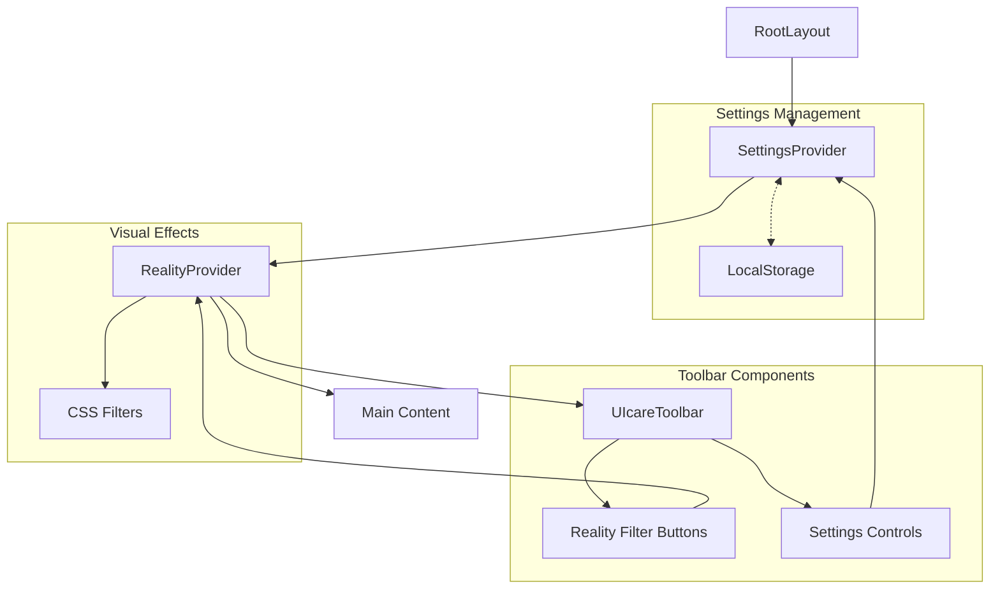

# UICare System Patterns

## System Architecture

The UICare System follows a modern web architecture with these key layers:

```
┌─────────────────────────────────────┐
│            UICare System            │
├─────────────┬─────────────┬─────────┤
│  MoodRING   │   VSCode    │ Future  │
│  Web App    │  Extension  │ Modules │
├─────────────┴─────────────┴─────────┤
│        Azure AI Agents Layer        │
└─────────────────────────────────────┘
```

### MoodRING Web App
- **Next.js Application**: Built using the App Router pattern
- **Context-Based State Management**: Uses React Context for state
- **Component Composition**: Modular components with clear responsibilities
- **Persistent Settings**: LocalStorage for user preferences

### VSCode Extension
- **Event-Based Architecture**: Monitors coding patterns
- **AI Decision Pipeline**: Context collection → Analysis → Suggestion
- **WebView UI**: For displaying suggestions and interventions

## Key Technical Decisions

1. **Next.js App Router**: Selected for its improved rendering options and simplified routing
2. **React Context API**: Chosen over Redux for simpler state management with React's built-in tools
3. **Tailwind CSS**: Used for rapid styling and consistent design system
4. **LocalStorage**: Used for client-side persistence of settings
5. **Framer Motion**: Selected for smooth animations with accessibility options
6. **Azure AI Agents**: For emotion detection and suggestion generation

## Design Patterns

### Provider Pattern
Used extensively to create context-aware components that can access shared state:
- `SettingsProvider`: Manages and persists user settings
- `RealityProvider`: Controls visual filter states

### Compound Components
Used to create cohesive feature sets with shared state:
- Reality Filters + Reality Provider
- Settings Panel + Settings Context

### Strategy Pattern
Used for handling different reality filter implementations:
- Each filter (ninja, protocol) has its own strategy for modifying the UI

### Observer Pattern
Used to monitor user interactions:
- Reality filter changes can trigger audio feedback
- Settings changes are observed to update the UI

## Component Relationships



## Data Flow

1. **Settings Flow**:
   - User adjusts settings in UIcareToolbar or SettingsPanel
   - Changes update SettingsContext state
   - Updates are persisted to LocalStorage
   - Components consuming SettingsContext re-render

2. **Reality Filter Flow**:
   - User selects a filter in RealityFilter component
   - Selection updates RealityContext state
   - RealityProvider applies corresponding CSS filters
   - Optional audio feedback if enabled in settings

3. **Future AI Integration Flow**:
   - User interactions are monitored
   - Patterns are analyzed by Azure AI Agents
   - Suggestions are generated based on analysis
   - UI is adapted accordingly
